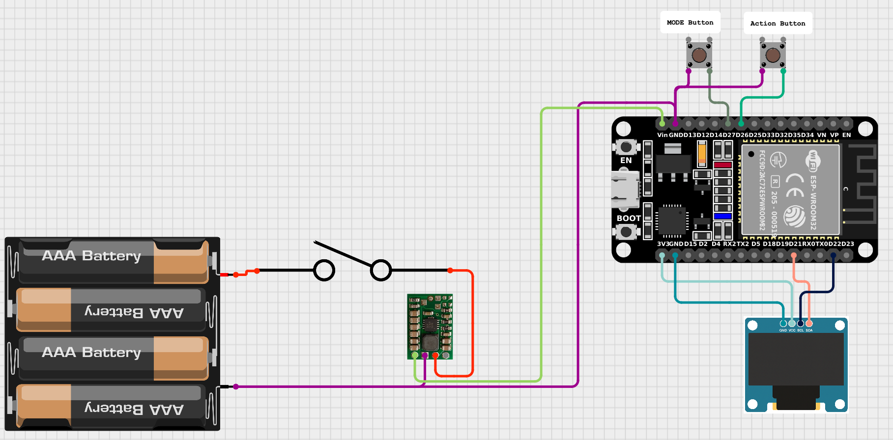
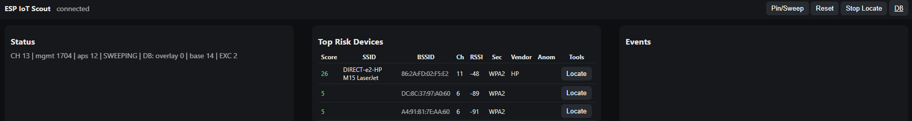
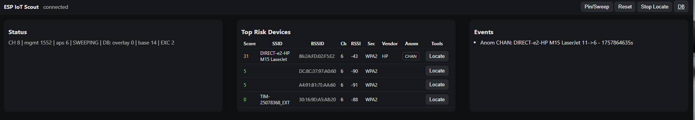
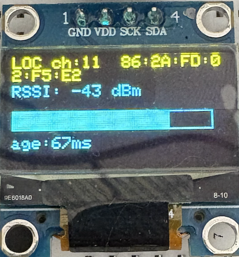
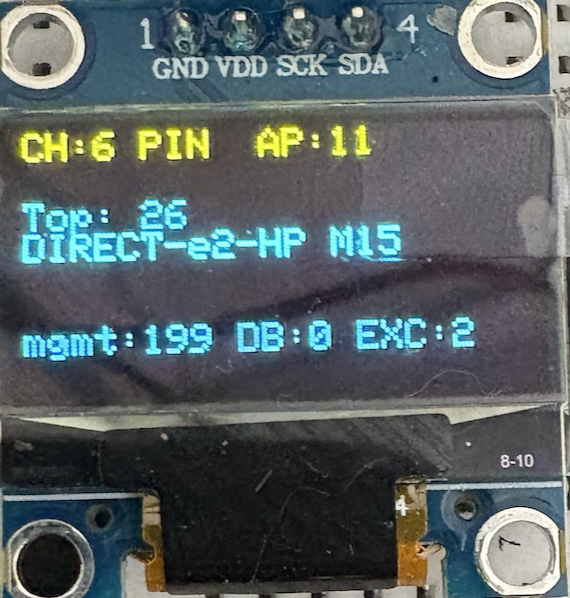

# ESP IoT Scout 

**ESP32-based IoT Wi-Fi Reconnaissance & Risk Scoring Tool**  
A lightweight, standalone device to detect, fingerprint, and score nearby Wi-Fi/IoT networks.  

---

## Features
- **Passive Wi-Fi Scanning**  
  Detects beacons and probe responses from 2.4 GHz networks.
- **IoT Fingerprinting**  
  Uses OUI database, SSID patterns, and overlay DB to identify IoT vendors (Tuya, Shelly, Sonoff, etc.).
- **Risk Scoring**  
  Evaluates security strength (Open/WEP/WPA/WPA2/WPA3), default SSIDs, vendor risk levels.
- **Hidden SSID Detection**  
  Reveals when devices broadcast hidden SSIDs.
- **Exclusion List**  
  Ignore corporate / known SSIDs and keep your view clean.
- **Anomaly Detection**  
  Detects suspicious changes such as:
  - **DOWN**: Security downgrade
  - **CHAN**: Channel hopping
  - **EVIL**: Rogue AP (same SSID, different BSSID/security)
- **Locate Mode**  
  Pinpoint a device by monitoring its RSSI (signal strength).
- **Web Dashboard**  
  Access via ESP32 AP, view live risk table, events, and manage OUI/Exclude DB.
- **On-Device Display**  
  Small OLED screen shows status, top risk AP, and channel sweeps.

---

## Hardware
- **ESP32 DevKit** (any ESP32-WROOM board)
- **Display**: SSD1306 128×64 OLED (I²C)
- **Buttons**: 2 × momentary push buttons
- **Optional**: External battery pack or case

### Wiring
| Component  | ESP32 Pin  |
|------------|------------|
| SSD1306 SCL | GPIO 22   |
| SSD1306 SDA | GPIO 21   |
| Button (Mode) | GPIO 27 |
| Button (Action) | GPIO 26 |
| VCC | 3.3V |
| GND | GND  |

**Wiring Scheme (DRAFT)t**
  

---

## Software
- [PlatformIO](https://platformio.org/) (Arduino framework)  
- Libraries:
  - `ESPAsyncWebServer`
  - `ArduinoJson`
  - `Adafruit SSD1306`
  - `Adafruit GFX`
  - `LittleFS`

---

## How It Works

The ESP IoT Scout runs on an ESP32 DevKit, passively listening to Wi-Fi management frames (beacons, probe responses) in the 2.4 GHz band.  
It builds a live model of nearby access points and IoT devices, assigns a risk score, and reports anomalies.  
The system can be operated with two physical buttons and/or a built-in web user interface.

---

### Core Functions

#### 1. Passive Scanning
- The ESP32 cycles through channels 1–13 (unless pinned by the user).  
- Captures **beacons** and **probe responses**.  
- Extracts:
  - SSID
  - BSSID (MAC address of the AP)
  - Channel
  - Signal strength (RSSI)
  - Security flags (Open, WEP, WPA, WPA2, WPA3)
- Updates a live device table with timestamp, average signal, and last seen parameters.

#### 2. IoT Fingerprinting
- Identifies vendors based on OUI (the first 3 bytes of a MAC address).  
- Matches SSID patterns (e.g. `DIRECT-*-HP*` for HP printers, `ESP_*` for Espressif, `Shelly*` for Shelly relays).  
- Overlay database (uploaded by the user) allows adding new or custom OUIs.  
- Optional Bloom filter provides a lightweight test for “likely IoT” if OUI is unknown.

#### 3. Risk Scoring
Each access point is given a score from 0 (low risk) to 100 (high risk).  
Factors include:
- **Security type**: Open networks score highest, WPA3 the lowest.  
- **Default SSID**: Vendors with unchanged default names add to the score.  
- **Vendor risk baseline**: Some IoT vendors are considered higher risk.  
- **Hidden SSIDs**: Extra points if a network does not broadcast a name.  
- **Likely IoT**: If vendor unknown but Bloom filter suggests IoT, small bump.

#### 4. Anomaly Detection
The Scout continuously compares current and past parameters of each AP.  
It flags:
- **DOWN**: Security downgrade (e.g., from WPA2 to WEP).  
- **CHAN**: Channel hopping or unexpected channel shifts.  
- **EVIL**: Rogue access point with same SSID but different BSSID/security.  

---

### Example: HP Printer Wi-Fi Direct

In one test, an HP printer broadcasting a **default Wi-Fi Direct SSID** was simulated.  
- Initial detection:  
  - SSID matched pattern `DIRECT-*-HP*`  
  - Vendor recognized as HP, category Printer  
  - Default SSID flag applied  
  - Risk score increased due to default SSID and vendor baseline  

**IoT Detection**  
  

- Behavior anomaly:  
  - The printer was manually forced to hop between channels (e.g., 6 → 11 → 1)  
  - ESP IoT Scout observed the channel shifts and raised a **CHAN** anomaly  
  - The device remained on the “Top Risk Devices” list with updated risk scoring  

**Anomaly Detection**  
  
A CHAN Anomaly will be showed and logged, risk score will automatically increase

This demonstrates how the tool highlights **default configuration risks** and **unusual behavior** in IoT devices.

---

### 5. Exclusion List
- Specific SSIDs or BSSIDs can be excluded by adding them to `/data/exclude.txt`.  
- Excluded networks are not shown in the risk table or OLED view.  
- Useful in environments with known trusted Wi-Fi (e.g., corporate SSIDs).

---

### 6. Locate Mode

**Locate Function**  
  

- Any device in the table can be marked as “target”.  
- Once targeted, the OLED displays its RSSI trend.  
- Allows the user to walk around and locate the device by signal strength.  
- Currently triggered via web API or button ( Only top risk); planned on-device button navigation will allow scrolling through high-risk devices and selecting one.

---

### 7. OLED Status Display

**OLED default Display**  
  

The OLED provides a quick glance view:
- Current channel (pinned or sweeping)  
- Number of detected APs  
- Top risk device SSID and score  
- Total management frames seen  
- Overlay DB entries loaded  

---

### 8. Buttons
Two push-buttons extend functionality without the web UI:
- **Mode button (GPIO 27)**  
  Short press → toggle between channel sweep and pin mode.  
- **Action button (GPIO 26)**  
  Short press → reset tables (clear AP list, events).  
  Long press → cycle through pinned channels (1 → 6 → 11).  

---

### 9. Web User Interface
The ESP32 also runs as an access point (`ESP-IoT-Scout / esp32pass`).
Open `http://192.168.4.1` to access the dashboard:
- **Status panel**: channel, AP count, management frame count  
- **Top Risk Devices**: sortable table with SSID, BSSID, channel, RSSI, security, vendor, score  
- **Events log**: anomalies such as DOWN, CHAN, EVIL  
- **Database page**: upload OUI overlays, manage exclusion list  

---

## Getting Started
1. Clone the repository:
   ```bash
   git clone https://github.com/your-username/ESP_iot_scout.git
   cd ESP_iot_scout
2.	Open with PlatformIO (VS Code).
3.	Flash to your ESP32.
4.	Connect to Wi-Fi AP:
    SSID: ESP-IoT-Scout
    Pass: esp32pass
5.	Open browser: http://192.168.4.1

## File System Layout
	•	/data/oui.csv → OUI overlay DB (upload via /db page)
	•	/data/exclude.txt → List of excluded SSIDs/BSSIDs

---

## Roadmap
	•	On-device UI navigation for selecting targets
	•	Persistent device history (first_seen/last_seen)
	•	Probe request / client detection
	•	Export anomalies via MQTT/syslog
	•	Improved locate mode with audible feedback
    •	3d Printable case
     •	Better Documentation :)


---

## License

Released under the MIT License.
Free to use, modify, and share with attribution.

---

## Credits

This project is inspired by Wi-Fi reconnaissance tools but with a special focus on IoT device risk scoring.

